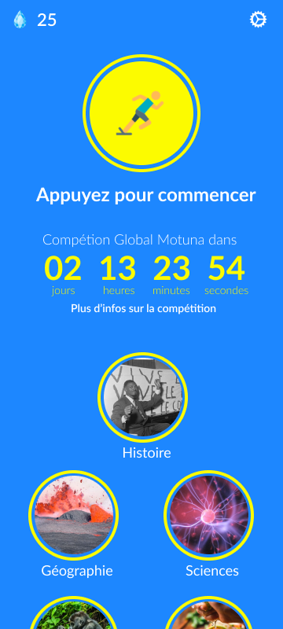
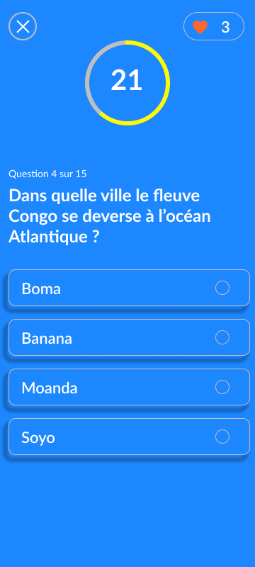

# Mituna - Application de Quiz sur la RDC et le Monde

Mituna est une application de quiz passionnante qui met à l'épreuve vos connaissances sur la République Démocratique du Congo (RDC) ainsi que sur diverses questions liées au monde.

## Captures d'écran

## Fonctionnalités

- Quiz sur la RDC : Testez vos connaissances sur l'histoire, la culture, la géographie et d'autres aspects de la RDC.
- Questions mondiales : Explorez des questions variées sur des sujets internationaux pour élargir vos horizons.
- Classements : Consultez les classements pour voir comment vous vous situez par rapport aux autres joueurs.

## Installation

1. Clonez ce dépôt : `git clone https://github.com/oseeshogun/mituna.git`

2. Installez les dépendances : `flutter pub get`

3. Mettre en place firebase:

   - `npm install -g firebase-tools`

   - `dart pub global activate flutterfire_cli`

   - `flutterfire configure`

   Pour plus de details visiter le site officiel de la documentation firebase pour flutter [FireFlutter](https://firebase.flutter.dev/docs/overview)

4. Mettre en place [FunctionsHttpUrls]:

   Les apis de ce projet ont ete cree par [Cloud functions](https://firebase.google.com/docs/functions) et chaque fonction http de cloud functions a son propre url.

5. Lancez l'application : `flutter run`

## Contribuer

Nous accueillons volontiers les contributions à Mituna. Si vous souhaitez contribuer, veuillez soumettre une pull request avec vos modifications.

## Auteurs

- [Osee Masuaku](https://github.com/oseeshogun) - Développeur principal

## Licence
